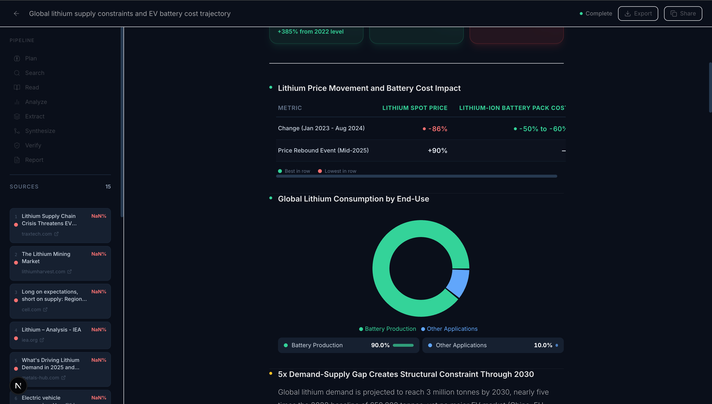

# FinSight — Deep Research Agent

> Multi-agent financial research pipeline powered by LangGraph, Claude AI, and FastAPI.


---

## What it does

Ask any financial research question. The agent autonomously plans, searches, reads, analyzes, and writes a structured report — with charts, comparison tables, and cited sources.




---

## Architecture

```
Plan → Search → Read → Analyze → Extract → Synthesize → Verify → Report
                                                            ↑           ↓
                                                    (retry weak)   (if score < 50)
```

**Key features:**

- **8-node LangGraph pipeline** with conditional verification loop — re-searches sub-questions that score below a quality threshold
- **Human-in-the-Loop (HITL)** — agent pauses after planning, user can edit sub-questions before deep research begins (`interrupt()` + `Command(resume)`)
- **MCP server** — exposes search and page-read tools via FastMCP, usable from Claude Desktop
- **Real-time SSE streaming** — watch each step complete live, section by section
- **Structured reports** — trend charts, comparison tables, market share donuts, risk matrix, timeline

---

## Tech Stack

| Layer | Stack |
|---|---|
| Agent | LangGraph, Claude Haiku (Anthropic API) |
| Backend | Python, FastAPI, PostgreSQL, Redis |
| Frontend | Next.js 14, TypeScript, Tailwind CSS, Recharts, Framer Motion |
| Infrastructure | Docker Compose, Prometheus, Grafana, Kubernetes (k8s/) |
| MCP | FastMCP server for Claude Desktop integration |

---

## Quick Start

```bash
# 1. Clone
git clone https://github.com/Islene888/deep-research-agent.git
cd deep-research-agent

# 2. Configure environment
cp backend/.env.example backend/.env
# Fill in ANTHROPIC_API_KEY, SERPER_API_KEY, JINA_API_KEY

# 3. Start all services
docker compose up --build

# 4. Open
# Frontend: http://localhost:3000
# API docs: http://localhost:8000/docs
# Prometheus: http://localhost:9090
```

---

## Project Structure

```
backend/
  agent/nodes/    # plan, search, read, analyze, extract, synthesize, verify, report
  api/            # FastAPI endpoints + SSE streaming
  services/       # worker, queue (Redis pub/sub), events, credibility scoring
  mcp/            # FastMCP search + read servers
frontend/
  app/            # Next.js pages (home, research/[id], history)
  components/     # Section renderers, StepTimeline, SourcePanel, InteractionStats
  lib/            # useResearchStream (SSE hook), types, api client
k8s/              # Kubernetes deployment manifests
mcp-server/       # Standalone MCP server for Claude Desktop
```

---

Built by [Ella Zhao](https://github.com/Islene888)
